I create gameplay-driven experiences focused on player progression, puzzle design, and immersive environments. I have worked on solo-developed games, level design, animation, and original IP development.

---

## Selected Work

### 🐾 Kitty Run
**Engine:** Unity  
**Role:** Solo Developer (Design & Programming)

A fully self-developed game built from concept to completion.  
- Designed levels 
- Implemented player mechanics

 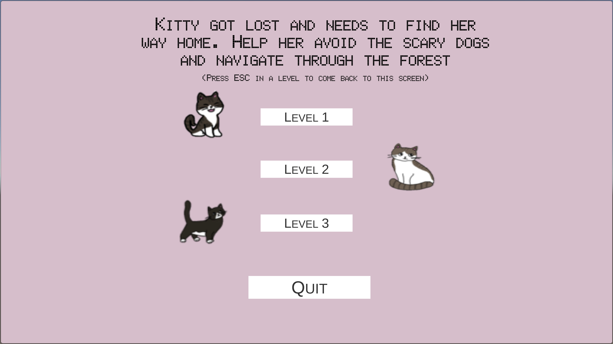
 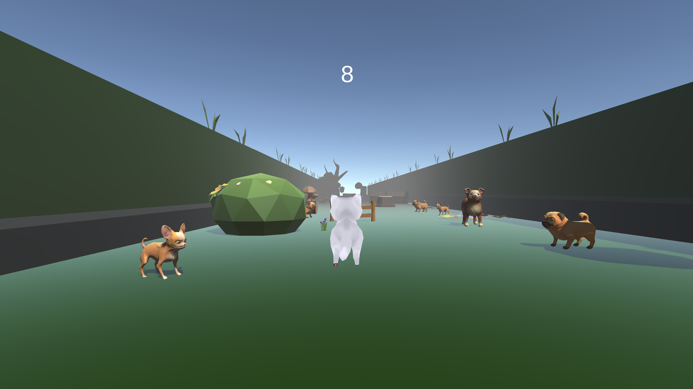

---

### 🌟 Hope’s Journey
**Engine:** Unity  
**Role:** Solo Developer (Design & Programming)

**LINK:** https://sellenahedden.itch.io/hopes-journey

A narrative-focused experience built independently.  
- Designed levels  
- Implemented systems and interactions

 
 

---

### 🧩 Puzzle Tower
**Engine:** Unreal Engine  
**Role:** Level Designer & Gameplay Programmer

**LINK:** https://tatsuyam.itch.io/puzzle-tower

A multi-level puzzle experience.  
-Designed floor layouts for tower
- Designed puzzles for Level 2 & Level 3  
- Programmed Level 3

 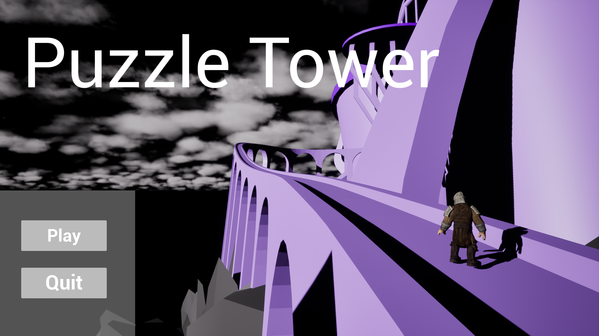
 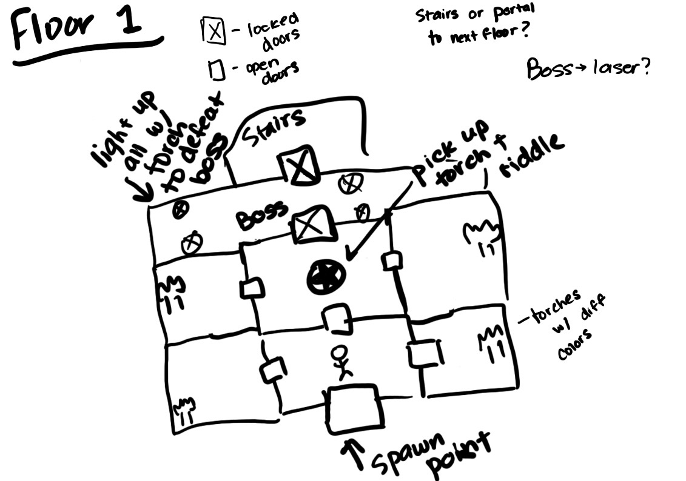

 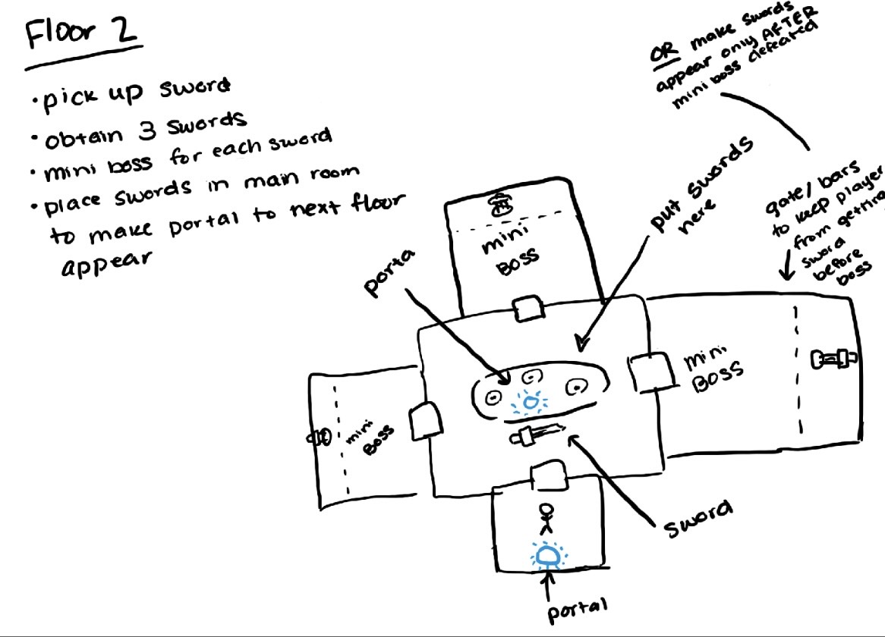
 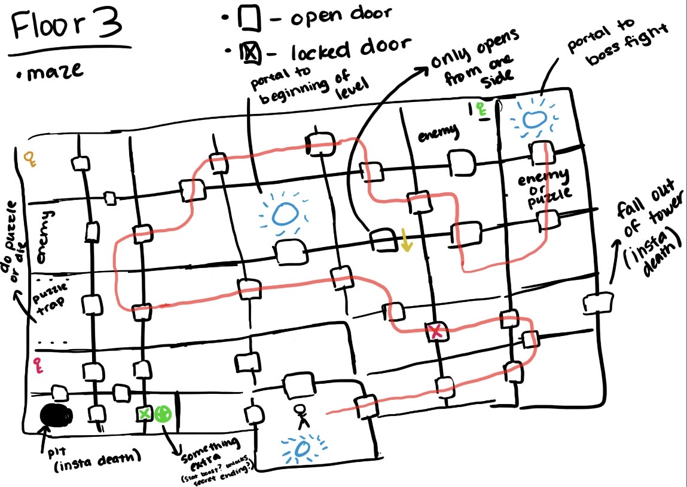

---

### 🎬 Animated Scene (8 Seconds)
**Software:** Maya  
**Role:** Animator, Environment Artist, Sound Designer

**LINK:** https://drive.google.com/file/d/1GkozVctvApFRdBpXLpCX1CqPs55_8pow/view?usp=sharing

- Modeled entire environment from scratch  
- Animated scene  
- Recorded and implemented sound  

 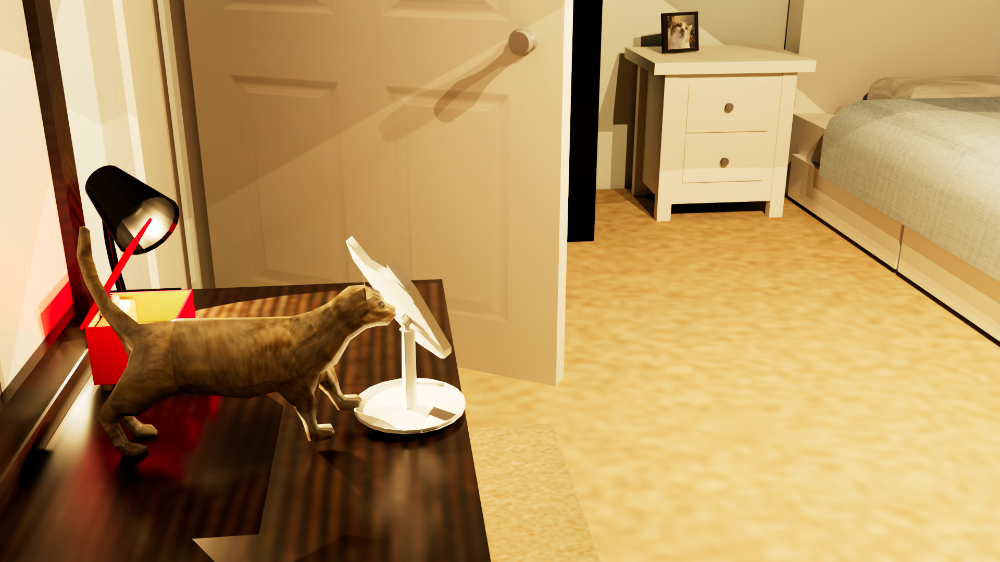
 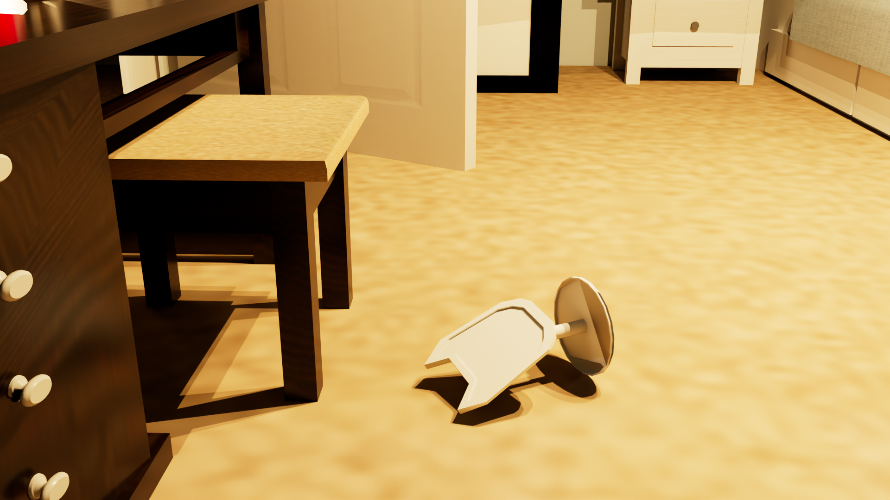

---

### 🎯 Valorant Character Concept

- Designed abilities and skill kit   
- Balanced mechanics around tactical utility  

 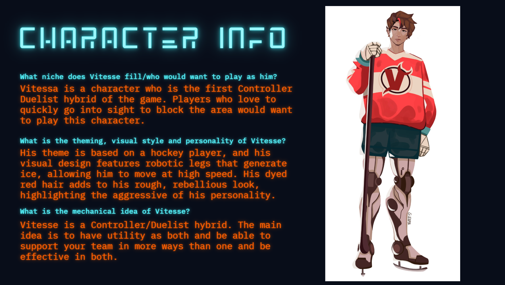
 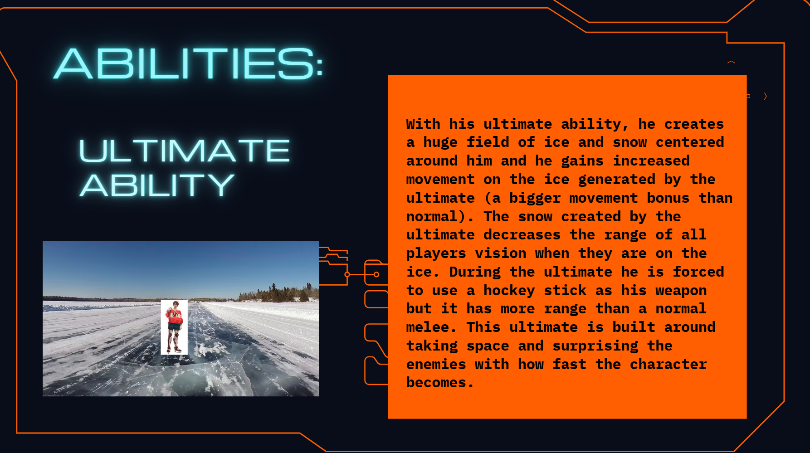

---

### 📖 A Cat's Journey
Original game IP written independently.  
- Developed worldbuilding and tone  
- Structured narrative arc  
- Created and defined characters

 
 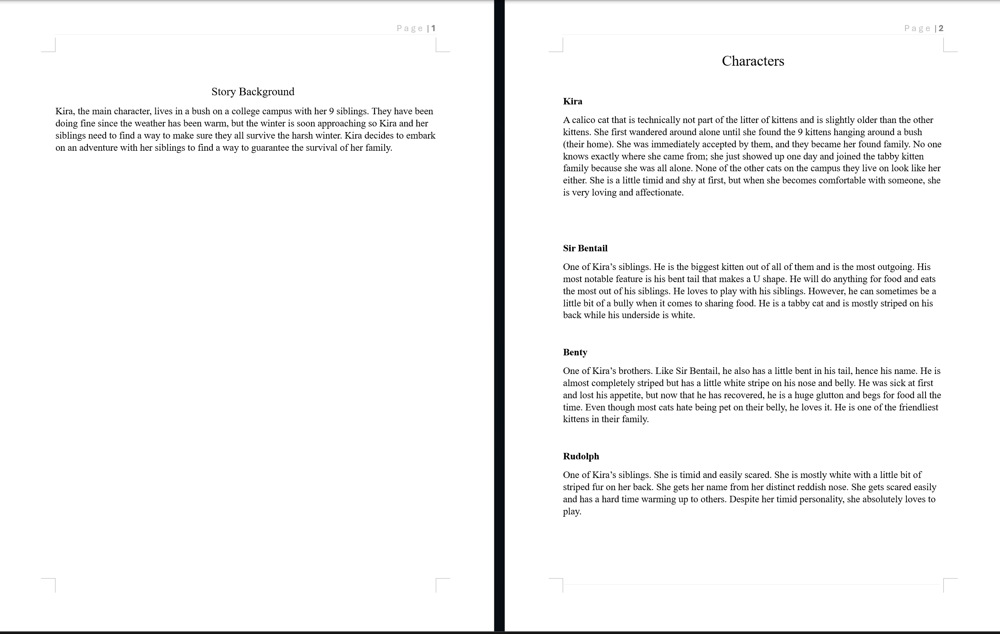

---

Unity | Unreal Engine | Maya | 3DS Max | Photoshop | InDesign | Premiere
